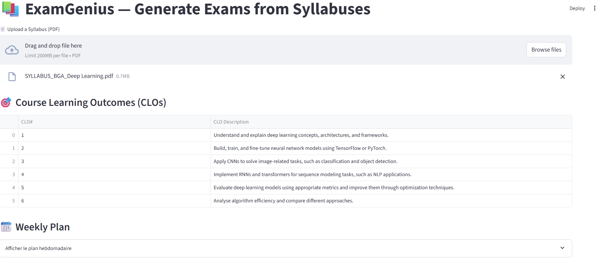
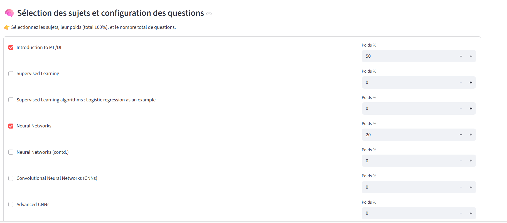
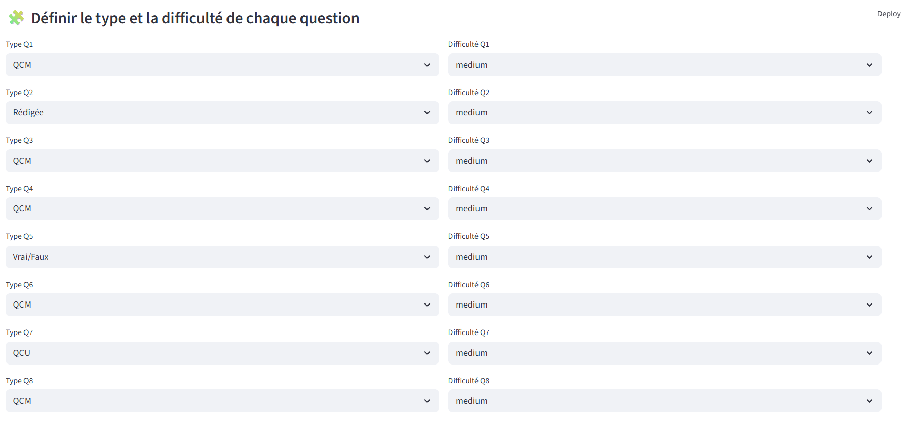

# ExamGenius: AI-Powered Exam Generator

ExamGenius is a Streamlit web application that automatically generates exam questions from a course syllabus PDF. It uses AI, specifically the Groq API with Llama 3, to create multiple-choice and short-answer questions based on the key topics identified in the syllabus.

## ✨ Features

- **Syllabus Parsing**: Extracts text and key topics from any syllabus PDF.
- **AI-Powered Question Generation**: Uses the Groq API to generate relevant exam questions.
- **Customizable Exams**: Configure the exam's difficulty, number of multiple-choice questions, and number of short-answer questions.
- **PDF Export**: Download the generated questions as a formatted PDF.
- **User-Friendly Interface**: Simple and intuitive web interface built with Streamlit.

## � Demo Screenshots

Here's a visual walkthrough of the ExamGenius application:

### Main Interface



### Question Generation Process



### Generated Exam Output



## �📋 Prerequisites

- Python 3.8+
- A Groq API Key

## 🚀 Setup and Installation

Follow these steps to set up and run the project locally.

### 1. Clone the Repository

It is assumed you have already cloned the repository.

### 2. Create a Virtual Environment

It's recommended to use a virtual environment to manage project dependencies.

```bash
# For Linux/macOS
python3 -m venv venv
source venv/bin/activate

# For Windows
python -m venv venv
venv\Scripts\activate
```

### 3. Install Dependencies

Install all the required Python packages using the `requirements.txt` file.

```bash
pip install -r requirements.txt
```

### 4. Configure Environment Variables

The application requires a Groq API key to function.

1.  Create a file named `.env` in the root directory of the project.
2.  Add your Groq API key to the `.env` file as follows:

    ```
    GROQ_API_KEY="your_grok_api_key_here"
    ```

    You can get a free API key from the [Groq Console](https://console.groq.com/keys).

## 🏃‍♀️ Running the Application

Once the setup is complete, you can run the Streamlit application with the following command:

```bash
streamlit run main.py
```

This will start the web server and open the application in your default web browser.

## 📂 Project Structure

The project is organized into the following directories and files:

```
.
├── data/                  # For storing parsed data and indexes
├── raw_data/              # For storing uploaded raw files
├── src/                   # Source code
│   ├── acquisition/       # Data processing and embedding
│   ├── generation/        # Exam generation logic
│   ├── models/            # AI model wrappers
│   ├── parsing/           # Syllabus parsing logic
│   └── utils/             # Utility functions (caching, PDF generation)
├── .env                   # Environment variables (needs to be created)
├── main.py                # Streamlit application entry point
├── requirements.txt       # Project dependencies
└── README.md              # This file
```
